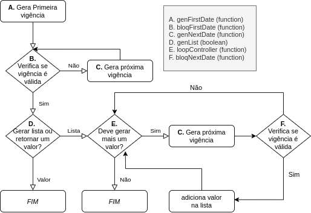

<!-- TABLE OF CONTENTS -->
## Table of Contents

* [Sobre o Projeto](#sobre-o-projeto)
* [Getting Started](#getting-started)
  * [Pré-requisitos](#pré-requisitos)
  * [Instalação](#instalação)
  * [Execução](#execução)
* [Forma de uso](#forma-de-uso)
  * [Visão Geral](#visão-geral)
  * [Argumentos](#argumentos)
  * [Retorno](#retorno)
* [Exemplos](#exemplos)
	* [Exemplo 1](#exemplo-1)
	* [Exemplo 2](#exemplo-2)
	* [Exemplo 3](#exemplo-3)
* [Templates](#templates)
	* [Descrição](#descrição)
	* [Forma de uso](#forma-de-uso)
	* [Templates disponíveis](#templates-disponíveis)

<!-- ABOUT THE PROJECT -->
## Sobre o Projeto
Este programa gera uma ou mais datas a partir de uma data de entrada e configurações introduzidas pelo usuário. Ele foi motivado pelo seguinte problema: após o fechamento de um contrato, não necessariamente deseja-se que este entre em vigor imediatamente após sua data de assinatura. Esta data referida é a data de vigência - termo usado exaustivamente na documentação. 

Leva-se em conta, também, que o contratante pode não ser o titular do contrato, e que este contratante possa optar por uma lista de vigências permitidas a partir de critérios pré-estabelecidos.


<!-- GETTING STARTED -->
## Getting Started

Aqui, são informações para que você possa testar o projeto.

### Pré-requisitos

O único pré-requisito é possuir o [Node](https://nodejs.org/en/) instalado em sua máquina

### Instalação

1. Baixe o repositório. Caso possua o git, com o seguinte comando:
```sh
git clone https://github.com/TadeuOliveira/GenVigencia.git
```

### Execução

Edite o arquivo ```testvigencia.js``` e execute-o com ```node testvigencia.js``` tendo em mente a documentação a seguir.

## Forma de uso

Aqui, será explicado todo o processo de como criar uma vigência usando este _"framework"_. Mesmo que para você baste usar um [template](#templates) sem adição ou sobrescrição de propriedades, a leitura deste segmento é importante para saber como a coisa funciona por debaixo dos panos.

### Visão geral

O usuário deve chamar a função ``geraVigencia`` com os seguintes parâmetros:

- isodate _(String 'YYYY-mm-dd')_
- vigenciaConfig _(Object object)_

**isodate** é simplesmente uma data. 
O objeto **vigenciaConfig** diz respeito às regras de como executar o cálculo da vigência. Abaixo, é mostrado o fluxograma ilustrando como é feito este cálculo:

<p align="center">
	
<p>

Todas as funções devem possuir a chave _func_, onde é implementada a função executada no momento em que é chamada. Além desta, há a chave opcional _args_, que diz respeito aos argumentos fixos desta função, onde podem constar quaisquer coisas que o usuário desejar, desde que constem em _func_. 

O leitor que detém algum conhecimento sobre programação funcional deve ter percebido, neste momento, que isto poderia ser feito com _currying_, evitando a necessidade de repetição dos argumentos fixos. No entanto, para  fins de reduzir ao máximo o grau de complexidade - mesmo que teórica - na utilização do programa, opta-se pela redundância.

O campo **forceSort**, que pode ser encontrado no código, não é apresentado neste diagrama por não alterar em nada o fluxo da geração de vigência. Trata-se de um booleano que determina se o programa deve ordenar as datas (o que pode ser útil se existe um retrocesso na geração de vigências numa lista.

### Argumentos
Os argumentos para as funções são os seguintes:

- **genFirstDate**
	- isodate: data de entrada do programa, sobre a qual será calculada esta primeira vigência
	- args: objeto contento as chaves inseridas no objeto _args_
- **bloqFirstDate**
	- isodate: data calculada pelo _genFirstDate_ (ou retornada pelo _genNextDate_)
	- args: objeto contento as chaves inseridas no objeto _args_
	- initdate: data de entrada do programa (a mesma de isodate em _genFirstDate_)
- **genNextDate**
	- isodate: data calculada pelo _genFirstDate_ (ou retornada pelo _genNextDate_)
	- args: objeto contento as chaves inseridas no objeto _args_
- **loopController**
	- isodate: data calculada pelo _genNextDate_
	- loopIndex: o índice do loop. Seu valor é 0 na primeira iteração
	- list: referência para a lista corrente
	- args: objeto contento as chaves inseridas no objeto _args_
	- initdate: data de entrada do programa (a mesma de isodate em _genFirstDate_)
- **bloqNextDate**
	- isodate: data calculada pelo _genNextDate_
	- loopIndex: o índice do loop. Seu valor é 0 na primeira iteração
	- list: referência para a lista corrente
	- args: objeto contento as chaves inseridas no objeto _args_
	- initdate: data de entrada do programa (a mesma de isodate em _genFirstDate_)

### Retorno

O retorno das funções deve ser:

- _genFirstDate_: data no formato _YYYY-mm-dd_ (mesmo que vá ser gerada uma lista)
- _bloqFirstDate_: booleano informando <u>se a data deve ser <b>bloqueada</b>
- _genNextDate_: data no formato _YYYY-mm-dd_ (mesmo que vá ser gerada uma lista)
- _loopController_: booleando informando se deve ser feita mais uma iteração
- _bloqNextDate_: booleano informando <u>se a data deve ser <b>bloqueada</b>

### vigenciaHelpers

Algumas operações podem ser recorrentes nesta manipulação de datas. Para isto, o usuário tem acesso ao objeto ``vigenciaHelpers``, que contém operações não muito complexas que serão convenientes. Segue a lista atual destes utilitários:

- formatId: recebe um objeto Date e retorna sua data em formato _YYYY-mm-dd_
- formatIdLabel: recebe um objeto Date e retorna um objeto com sua data no formato ```{id: 'YYYY-mm-dd', label: 'dd/mm/YYYY}```
- convertIdToIdLabel: recebe uma string no formato _YYYY-mm-dd_ e retorna um objeto com sua data no formato ```{id: 'YYYY-mm-dd', label: 'dd/mm/YYYY}```
- skipNDays: recebe uma data no formato _YYYY-mm-dd_ e um inteiro _n_, retorna uma data no formato _YYYY-mm-dd_ que diz respeito à data anterior com o acréscimo de _n_ dias
- isAfterNDays: recebe uma data corrente (no formato _YYYY-mm-dd_), uma data destino (no mesmo formato) e um número _n_. Retorna um booleano, indica se a distância entre as datas é maior do que _n_ dias.
- getVigencia: recebe uma data no formato _YYYY-mm-dd_ e uma lista contendo objetos de regras, com as chaves min, max e vigencia, todos inteiros. Esta função calcula a data de vigência de forma que o dia da data de entrada esteja no intervalo fechado de min a max de algum dos objetos em regras. Por este motivo, **É INDISPENSÁVEL QUE TODOS OS 31 DIAS ESTEJAM CONTEMPLADOS NAS REGRAS** _(PS: não tem problema que nem todos os meses tenham 31 dias)_. Encontrado este objeto em regras, o dia de vigência será o valor presente na chave vigencia. O critério adotado para definir o mês é que o dia de vigência seja menor do que max.
- getNextVigencia: dispõe do mesmo input de getVigencia. No entanto, a data de entrada trata-se de uma vigência já calculada. É feita uma checagem no objeto de regras para que seja retornada a data de vigência posterior à recebida.
- getVigenciaOneCase: similar a getVigencia, porém, para o caso especial onde há apenas uma data de vigência - ocasionando em possíveis incrementos de dois meses.
- getNextVigenciaOneCase: pensado para ser usado em conjunto com getVigenciaOneCase. Simplesmente avança um mês.
- getVigenciaAgendada: similar ao _getVigencia_, porém, usando uma agenda. A agenda dispõe das mesmas chaves (min, max e vigencia), no entanto, são todas datas no formato _'YYYY-mm-dd'_ ao invés de inteiros. Neste modelo, é simplesmente buscada a entrada da agenda onde a data de entrada encontre-se no intervalo de min e max, retornando a data na chave _vigencia_
- getNextVigenciaAgendada: busca na agenda a próxima data de vigência.

## Exemplos

Serão apresentados alguns exemplos de objetos **vigenciaConfig** e o valor retornado pelo programa. Em todos os casos, será considerada a data de entrada _2020-05-12_. O objeto dbwrapper está sendo carregado na variável _dbw_. 

### Exemplo 1

Neste exemplo, deseja-se que a data de vigência consista na data atual com o acréscimo de 5 dias. No entanto, seu dia deve ser inferior a 15. 

A primeira data gerada será 2020-05-17, no entanto, ela será bloqueada já que seu dia (17) é maior do que 15. Similarmente com 2020-05-22 e 2020-05-27, gerados na rotina de genNextVigencia. Apenas o próximo valor, 2020-06-01, passa pelo bloqueio, sendo a vigência resultando desse processo.

```
let vigConfig = {
    genFirstDate: {
        func: (isodate,args) => {
            return dbw.helpers.skipNDays(isodate,5)
        },
    },
    bloqFirstDate: {
        func: (isodate,args,initdate) => {
            return new Date(isodate+'T00:00:00').getDate() > 15
        },
    },
    genNextDate: {
        func: (isodate,args) => {
            return dbw.helpers.skipNDays(isodate,5)
        },
    },
    genList: false
}
```

### Exemplo 2

Neste exemplo, deseja-se uma lista com as 3 próximas vigências a partir de uma agenda. Consideremos a seguinte agenda:

```

let agenda = [
    {
        min: '2020-04-16',
        max: '2020-04-30',
        vigencia: '2020-05-01'
    },
    {
        min: '2020-05-01',
        max: '2020-05-15',
        vigencia: '2020-06-01'
    },
    {
        min: '2020-05-16',
        max: '2020-05-31',
        vigencia: '2020-06-15'
    },
    {
        min: '2020-06-01',
        max: '2020-06-15',
        vigencia: '2020-07-01'
    },
    {
        min: '2020-06-16',
        max: '2020-06-30',
        vigencia: '2020-07-15'
    },
    {
        min: '2020-07-01',
        max: '2020-07-15',
        vigencia: '2020-08-01'
    },
    {
        min: '2020-07-16',
        max: '2020-07-30',
        vigencia: '2020-08-15'
    },
    {
        min: '2020-08-01',
        max: '2020-08-15',
        vigencia: '2020-09-01'
    } 
]

```
É esperado então que o programa retorne a listagem com as datas: 2020-06-01, 2020-06-15 e 2020-07-01. Observe que, desta vez, é usado o objeto agenda em args.
```

let vigConfig = {
    genFirstDate: {
        func: (isodate,args) => {
            let {agenda} = args
            return dbw.helpers.getVigenciaAgendada(isodate,agenda)
        },
        args: {
            agenda
        }
    },
    bloqFirstDate: {
        func: (isodate,args,initdate) => {
            return false;
        },
    },
    genNextDate: {
        func: (isodate,args) => {
            let {agenda} = args
            return dbw.helpers.getNextVigenciaAgendada(isodate,agenda)
        },
        args: {
            agenda
        }
    },
    genList: true,
    loopController: {
        func: (isodate,loopIndex,list,args,initdate) => {
            return list < 3
        }
    },
    bloqNextDate: {
        func: (isodate,loopIndex,list,args,initdate) => {
            return false
        }
    }
}
```

### Exemplo 3

Aqui, serão usados dois argumentos incomuns: um para o dia inicial a ser gerada uma listagem de vigências e outro para o dia final. Deseja-se que seja gerada uma lista de vigências neste intervalo, para o mês corrente, englobando todos os dias. Exemplo: se estamos em maio de 2020, o dia inicial é 12 e o dia final é 15, devem ser gerados 2020-05-12, 2020-05-13, 2020-05-14 e 2020-05-15.

Adicionalmente deve haver um intervalo mínimo de 10 dias entre o dia atual e a primeira vigência listada. Por exemplo: se estivéssemos no dia 3 de maio de 2020, do exemplo acima, apenas os dias 14 e 15 seriam válidos.

Por fim, devem ser geradas estas datas para dois meses. Usando o exemplo anterior, a data posterior a 15 de maio seria 12 de junho e, a última, 15 de junho. No entanto, se estivéssemos no dia 7 de maio, as datas iriam de 12 de junho a 15 de junho e, junto a estas, de 12 de julho a 15 de julho.

Considerando estas informações, suponhamos que nos sejam dado os números mínimo e máximo como 20 e 25, e nossa data de partida é, novamente, 2020-05-12. A data gerada é 2020-05-20, já que toma-se o número mínimo como partida. No entanto, ela será bloqueada pelo bloqFirstDate, pois está a menos de 10 dias da data inicial. Dessa forma, o genNextDate irá gerar o próximo dia da lista: 21. Novamente será bloqueado pelo bloqFirstDate, assim como o dia 22. Alcançado o dia 2020-05-23, é iniciada a lista e entramos no loop.

O genNextDate irá gerar os dias 24 e 25. Percebendo que o dia limite foi alcançado, ele adiciona, dessa vez, o dia 20 do próximo mês, e assim em diante até o dia 25 deste mês, sendo parado pelo loopController. Note que não é necessário um bloqNextDate, pois nunca haverá um momento onde possa haver menos de 10 dias entre o dia inicial e o dia corrente, já que não são geradas datas antecessoras à primeira.

Segue abaixo o objeto de configuração. 

```

let vigConfig = {
    genFirstDate: {
        func: (isodate,args) => {
            let {iniVig} = args
            let d = new Date(isodate+'T00:00:00')
            let skipMonth = d.getDate() > iniVig
            d.setMonth(d.getMonth() + skipMonth)
            d.setDate(iniVig)
            return dbw.helpers.formatId(d)
        },
        args: {
            iniVig: 20
        }
    },
    bloqFirstDate: {
        func: (isodate,args,initdate) => {
            return !dbw.helpers.isAfterNDays(isodate,initdate,10)
        },
    },
    genNextDate: {
        func: (isodate,args) => {
            let {iniVig,finVig} = args
            let d = new Date(isodate+'T00:00:00')
            let reachedEnd = d.getDate() == finVig
            d.setMonth(d.getMonth() + reachedEnd)
            let newDate = reachedEnd ? iniVig : d.getDate()+1
            d.setDate(newDate)
            return dbw.helpers.formatId(d)
        },
        args: {
            iniVig: 20,
            finVig: 25
        }
    },
    genList: true,
    loopController: {
        func: (isodate,loopIndex,list,args,initdate) => {
            let {finVig} = args
            let primeiraVigencia = new Date(list[0].id+'T00:00:00')
            let dataAtual = new Date(isodate+'T00:00:00')
            return dataAtual.getDate() < finVig || dataAtual.getMonth()-primeiraVigencia.getMonth() < 1
        },
        args: {
            finVig: 25
        }
    },
    bloqNextDate: {
        func: (isodate,loopIndex,list,args,initdate) => {
            return false
        }
    }
}
```

## Templates

### Descrição

Este projeto mostra grande eficácia para cálculos complexos de vigência, como no [exemplo 3](#exemplo-3), mas não é verdade para cálculos mais rasos. Por isso, serão criados templates para estes casos, podendo ter apenas campos específicos alterados. 

Os templates receberão argumentos específicos para cada caso e, além disso, um objeto **updates** contendo as alterações necessárias. Por exemplo: se um template possui apenas a chave _genFirstDate_, pode ser passado na chave updates um objeto com chaves como _bloqFirstDate_ e _genNextDate_ para inserir um critério de bloqueio e um método para a geração de uma nova data. Ou então, a chave _genList_ como true e um _loopController_ juntamente com _genNextDate_ para gerar uma lista, ao invés de um valor apenas. Pode, também, sobrescrever o método em _genFirstDate_. Estes são apenas exemplos, mas a ideia é que tudo que está em updates será acrescentado ou reescreverá as informações no template.

### Forma de uso

Seguem exemplos de como usar templates para gerar regras simples de vigência rapidamente:
```
//importando template de vigência agendada
console.log('Agendada, apenas uma data:')
console.log(dbw.geraVigencia(
    '2020-05-12',
    dbw.templates.agendada(agenda)
))

//também é possível sobrecarregar os templates incluindo novas chaves
console.log('Agendada, uma lista de 3 datas:')
console.log(dbw.geraVigencia(
    '2020-05-12',
    dbw.templates.agendada(agenda,{
        genList: true,
        loopController: {
            func: (isodate,loopIndex,list,args,initdate) => {
                return list.length < 3
            }
        }
    })
))

```
### Templates disponíveis

Segue uma descrição dos templates implementados atualmente:

- **agendada**: recebe uma agenda, retorna a data de vigência que satisfaça a seguinte regra: a data atual deve estar entre a data mínima e a data máxima em alguma entrada na agenda.
- **direta**: recebe um objeto de regras, retorna a data de vigência que satisfaça a seguinte regra: o dia atual deve estar entre o dia mínimo e o dia máximo em alguma entrada nas regras.
